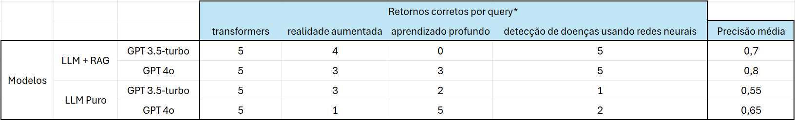

# Recomendador-de-Artigos-GraphRAG
Chatbot simples feito com o Streamlit para recomendação de artigos acadêmicos usando LLM e GraphRAG.

Autores:
> Gabriel Henrique Garcia Ticianeli 
> Nicole Barbosa Gomes 

#### Resultados de teste

---

## Preparação do ambiente

#### Dependências
streamlit 
openai 
langgraph 
langchain_openai 
google-search-results 

### Chaves da API
É necessário possuir chaves de api válidas para a OpenAI e SerpAPI. 
> https://platform.openai.com/api-keys 
> https://serpapi.com/manage-api-key 

Insira as chaves no local inficado em .streamlit/secrets.txt, e renomeie o arquivo para secrets.toml.

#### Inicializando o aplicativo
Em um terminal no ambiente, execute o comando: 
> streamlit run .\chatbot.py

## Usando o aplicativo

O aplicativo é um chatbot simples com opções para o método de busca e o modelo utilizado. Em todos os métodos, o usuário pode pedir por solicitações de artigos acadêmicos em linguagem natural, e o sistema tentará interpretar as informações relevantes do input e retornar os artigos solicitados.

#### LLM com GraphRAG

Neste método, é enviado uma solicitação para a llm recortar as informações pertinentes do input do usuário. Em seguida, uma busca da SerpAPI pesquisará as palavras chave no motor de busca do google acadêmico e retornará os artigos mais relevantes. Por fim, uma segunda chamada para a llm irá usar a busca do usuário e os artigos retornados para fazer as recomendações.

- Não é recomendado fugir do assunto e fazer outras requisições nesse métofo.

#### LLM pura

Neste método, uma chamada direte é enviada para a llm com o input do usuário. O modelo está instruido a retornar os artigos mais relevantes e válidos e pedir mais informações ao usuário quando necessário.

- Nesse método é possível que o usuário interaja com a llm fora do contexto de recomendação caso ele queira fazer outras perguntas.

#### API de busca

Neste método, o input do usuário é enviado diretamente para a busca no Google Acadêmico, retornando os primeiros artigos encontrados.

- Nesse método, é recomendado usar palavras chave diretamente, pois a api não interpreta a busca.

---

Trabalho realizado para a disciplina de “Aprendizado Profundo” do “Programa de Pós-Graduação em Ciência da Computação
(PPGCC) da Unesp”, ministrada pelo “Prof. Dr. Denis Henrique Pinheiro Salvadeo”.

> https://www.ibilce.unesp.br/#!/pos-graduacao/programas-de-pos-graduacao/ciencia-da-computacao/apresentacao/
